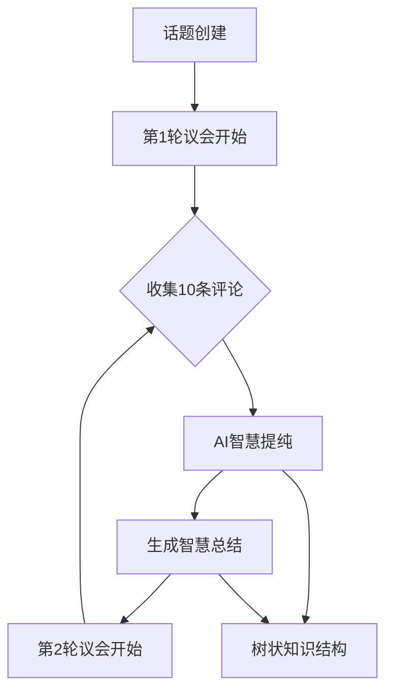
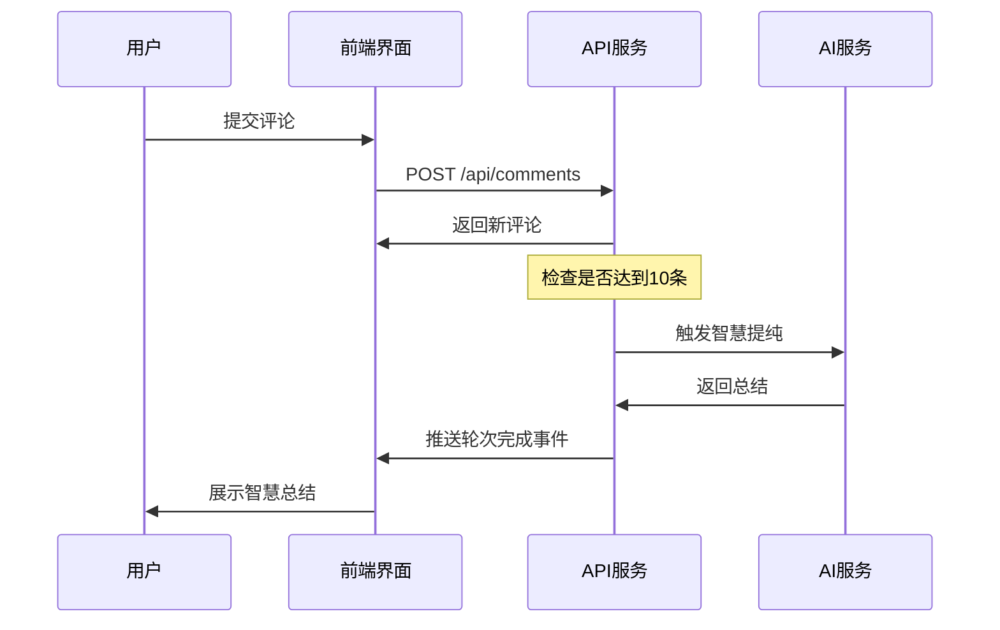

# Parliament Loop - 技术架构文档

## 🏛️ 核心概念实现

### 议会回环（Parliament Loop）机制



## 🔧 技术实现详解

### 1. 前端架构设计

#### 组件层级结构
```
TopicSpace (议会核心)
├── ParliamentRoundCard (轮次卡片)
│   ├── ProgressRing (进度环)
│   └── CommentNavigation (评论导航)
├── CommentForm (发言表单)
└── WisdomTreeView (智慧树视图)
```

#### 状态管理策略
```typescript
interface ParliamentState {
  currentRound: number;        // 当前轮次
  commentsInRound: number;     // 当前轮次评论数
  isAiProcessing: boolean;     // AI处理状态
  wisdomSummaries: Summary[];  // 智慧总结历史
}
```

### 2. 关键算法实现

#### 轮次计算算法
```typescript
// 根据评论总数计算当前轮次
const getCurrentRound = (totalComments: number) => {
  return Math.floor(totalComments / 10) + 1;
};

// 计算当前轮次剩余席位
const getRemainingSlots = (totalComments: number) => {
  return 10 - (totalComments % 10);
};
```

#### 智慧提纯触发条件
```typescript
const shouldTriggerWisdomDistillation = (comments: Comment[]) => {
  const currentRoundComments = comments.length % 10;
  return currentRoundComments === 0 && comments.length > 0;
};
```

## 🎨 UI/UX设计哲学

### 视觉设计原则

1. **议会庄严感**
   - 主色调：议会蓝 (#3B82F6)
   - 辅色调：智慧金 (#F59E0B)
   - 背景色：纯净白 (#FFFFFF)

2. **回环视觉隐喻**
   - 环形进度条呼应"回环"概念
   - 卡片式布局体现结构化
   - 渐变色彩展现演化过程

3. **仪式感强化**
   - 发言台式的表单设计
   - 轮次状态的仪表盘展示
   - AI处理的庄重动画效果

### 交互体验设计

#### 关键交互节点
1. **进入话题** → 展现当前轮次状态
2. **准备发言** → 显示剩余席位和角色
3. **提交评论** → 实时更新轮次进度
4. **轮次完成** → 智慧提纯仪式动画
5. **查看历史** → 树状结构可视化

#### 响应式设计策略
```css
/* 移动端优先的断点设计 */
.parliament-card {
  @apply w-full;           /* 手机: 全宽 */
  @apply md:w-1/2;         /* 平板: 半宽 */
  @apply lg:w-1/3;         /* 桌面: 三分之一宽 */
}
```

## 📊 数据模型设计

### 核心实体关系

```typescript
interface Topic {
  id: string;
  title: string;
  description: string;
  currentRound: number;      // 当前进行到第几轮
  totalComments: number;     // 总评论数
  wisdomSummaries: Summary[]; // 智慧总结列表
  createdAt: Date;
}

interface Comment {
  id: string;
  content: string;
  author?: string;
  topicId: string;
  roundNumber: number;       // 属于第几轮
  positionInRound: number;   // 在该轮中的位置
  createdAt: Date;
}

interface Summary {
  id: string;
  topicId: string;
  roundNumber: number;       // 总结第几轮
  content: string;          // AI提纯的智慧内容
  distillationSource: Comment[]; // 提纯来源评论
  createdAt: Date;
}
```

### 数据流转机制



## 🚀 性能优化策略

### 1. 前端性能优化

#### 组件懒加载
```typescript
// 大型组件延迟加载
const WisdomTreeView = lazy(() => import('./WisdomTreeView'));
const ParliamentRoundCard = lazy(() => import('./ParliamentRoundCard'));
```

#### 状态缓存策略
```typescript
// 使用React Query缓存API数据
const { data: comments } = useQuery(
  ['comments', topicId],
  () => api.getComments(topicId),
  { staleTime: 30000 } // 30秒缓存
);
```

### 2. 渲染优化

#### 虚拟滚动 (大量评论时)
```typescript
// 使用react-window处理大量评论渲染
const CommentList = ({ comments }) => (
  <FixedSizeList
    height={600}
    itemCount={comments.length}
    itemSize={120}
    itemData={comments}
  >
    {CommentItem}
  </FixedSizeList>
);
```

## 🔒 安全性考虑

### 输入验证
```typescript
// 评论内容安全验证
const validateComment = (content: string) => {
  if (content.length > 10000) {
    throw new Error('评论内容过长');
  }
  if (containsSpam(content)) {
    throw new Error('内容包含不当信息');
  }
  return sanitizeHtml(content);
};
```

### 频率限制
```typescript
// API调用频率限制
const rateLimiter = rateLimit({
  windowMs: 15 * 60 * 1000, // 15分钟
  max: 10, // 最多10次评论
  message: '发言过于频繁，请稍后再试'
});
```

## 🧪 测试策略

### 单元测试重点
```typescript
// 轮次计算逻辑测试
describe('Parliament Round Calculation', () => {
  test('计算当前轮次', () => {
    expect(getCurrentRound(5)).toBe(1);
    expect(getCurrentRound(10)).toBe(1);
    expect(getCurrentRound(15)).toBe(2);
  });
  
  test('计算剩余席位', () => {
    expect(getRemainingSlots(3)).toBe(7);
    expect(getRemainingSlots(10)).toBe(10);
  });
});
```

### 集成测试场景
1. 完整的议会回环流程测试
2. AI智慧提纯触发测试
3. 并发评论提交测试
4. 轮次切换边界条件测试

## 🔄 部署与CI/CD

### 构建优化配置
```javascript
// next.config.mjs
const nextConfig = {
  experimental: {
    optimizeCss: true,
    optimizePackageImports: ['lucide-react']
  },
  images: {
    domains: ['localhost']
  }
};
```

### 环境配置
```bash
# 生产环境变量
NEXT_PUBLIC_API_URL=https://api.parliament-loop.com
DATABASE_URL=mysql://user:pass@db:3306/parliament
AI_SERVICE_URL=http://ai-service:8080
```

---

**Parliament Loop - 技术与哲学的完美融合** 🏛️⚡
